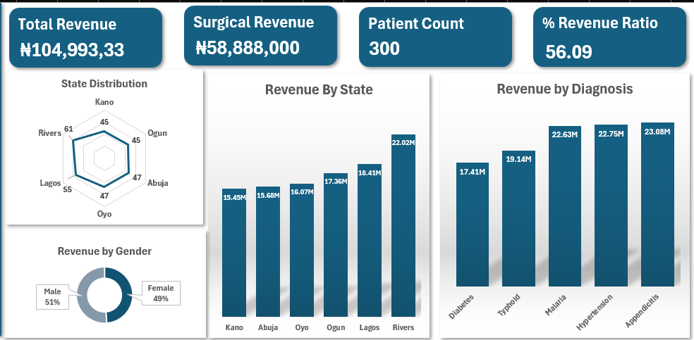
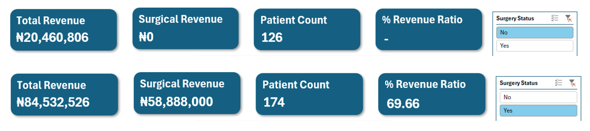
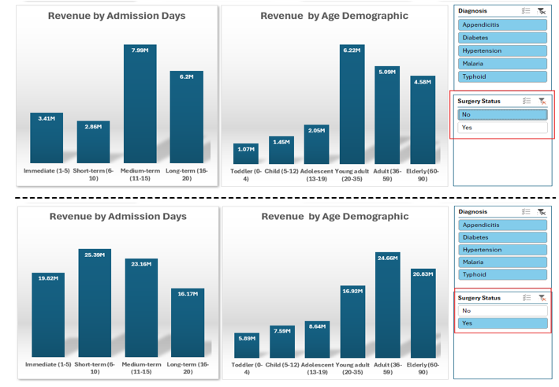
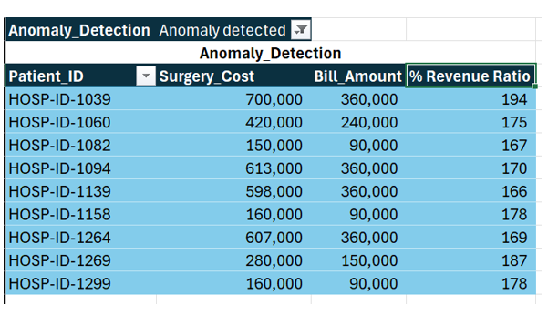

# In-patient_Revenue_Analysis

## Project Background
Amand Hospital is a multi-location healthcare organization in Nigeria providing inpatient services for both surgical and non-surgical cases. This project analyzes the hospital’s billing data to identify potential revenue leakages and evaluate the impact of surgical procedures on overall revenue.
The objective is to uncover billing inefficiencies and generate actionable insights that support stronger financial control and more informed operational decision-making.

### Insights and recommendations are provided on the following key areas:
1. **Total Revenue Analysis:** Evaluation of revenue trends across age demographics, diagnosis types, surgical status, and hospital location.
2. **Surgical Revenue Analysis:** Assessment of revenue contribution by diagnosis and surgical cost intensity.
3. **Ancillary Revenue Analysis:** Analysis of supporting revenue drivers, including medication usage and laboratory investigations.
4. **Billing Anomaly Detection:** Identification of billing discrepancies using revenue percentage ratios and cost-to-bill comparisons.

## Business Problem
Analyzing hospital billing data to identify revenue leakage and assess the contribution of surgical procedures to overall revenue performance.

## Data Structure & Initial Checks
The dataset contains 301 rows and 13 columns. Before analysis, several data quality and familiarization checks were performed to ensure accuracy and consistency. These included:

1. **Data cleaning** to standardize values and formats
2. **Validation of missing and null values**
3. **Identification and correction** of data inconsistencies
4. **Creation of derived columns** using IF functions for clearer categorization
5. **Use of Pivot Tables** to summarize and aggregate key metrics

These steps ensured the dataset was analysis-ready and suitable for identifying revenue trends and billing anomalies.

📊 Dataset & Analysis File  
These files are shared in view-only mode for portfolio review:

Summary: [View Summary Presentation](https://drive.google.com/file/d/1GLBf19w9bbLmvOUbCSdzRkTH1VQXxLLz/view?usp=sharing)

Excel: [View Excel Analysis](https://docs.google.com/spreadsheets/d/1zB_8LhJ5aGrrYFxiH8MDNGT_m38_0nDX/edit?usp=sharing&ouid=112966710535746080621&rtpof=true&sd=true)

## Executive Summary

### Overview of Findings
Analyzing the dataset revealed that procedure type and cost intensity, rather than patient volume alone, are the primary drivers of hospital revenue.
Surgical cases contribute disproportionately to total revenue, with short-term surgical admissions generating the highest returns, indicating that procedure intensity outweighs length of stay.

Also, revenue contribution increases with patient age, as adult and young adult groups are more likely to require complex, higher-cost interventions, with a decline observed in the elderly population.

These findings suggest that hospitals should prioritize surgical efficiency and strategically focus on adult and young adult care pathways to optimize revenue performance while reassessing cost recovery approaches for elderly care.
Growth in surgical admissions leads to increased consumption of medications and laboratory services, making surgery a key multiplier of ancillary revenue.

Below are samples of the analysis carried out and more examples are included throughout the report.

## Revenue Trends

1. Surgical Procedures Contribute Significantly to Revenue -The data shows that in surgical admissions, the surgical revenue makes up approximately 70% of the organization's total revenue. This suggests that surgical services are a significant contributor to the organization's overall financial performance.
2. Increased Surgical Volume Correlates with Higher Revenues - The analysis indicates that a higher proportion of patients received surgical treatment.  This implies that performing more surgical procedures is associated with generating greater revenue compared to regular inpatient admissions.

## Further Analysis into surgical and non-surgical admissions 

### Non-surgical cases
1. Based on admission length, medium-term admissions generated the highest revenue (₦8M), followed by long-term (₦6.2M), immediate (₦3.4M), and short-term cases (₦2.6M). This means that an increase in admission days can increase the revenue generated.
2. By age demographic, young adults generated the highest revenue (₦6.2M), while toddlers contributed the least (₦1M).
### Surgical Cases
1. Short-term surgical admissions generated the highest revenue (₦25M), followed by medium-term (₦23M), immediate (₦19M), and long-term cases (₦16M). In the case, shorter stays are more beneficial for the organization than longer stays.
2. From an age perspective, adults and the elderly were the top revenue contributors, with toddlers contributing the least (₦5.9M).

## Analyzing the Age Demographic

### Non-surgical cases
Revenue increases progressively across age groups, peaking in young adults, indicating higher healthcare utilization and treatment intensity within this demographic. Based on diagnosis, Appendicitis generated the highest revenue (₦4.81M) then Typhoid (₦4.53M), and followed by Malaria (₦4.22M).
### Surgical Cases 
Surgical revenue rises steadily from pediatric to adult age groups, peaking from young adults to the elderly, reflecting a higher incidence of surgery-driven diagnoses within these populations. Based on diagnosis, Hypertension generated the highest revenue (₦19.2M), then Malaria (₦18.4M), with the least being Diabetes(₦14M).

## Ancillary Revenue

- Surgery-driven admissions generate higher revenue not only from procedures but also from associated lab investigations, amplifying total billing per patient.
- Increased medication usage in surgical admissions further elevates total billing, positioning medications as a secondary revenue driver after surgery.

## Anomaly Detection

The picture above highlights several patient cases where the "% Revenue Ratio" exceeds 100%, indicating that the Surgical Cost is higher than the total Bill Amount. This suggests potential data quality issues or billing irregularities. 

### How can the anomaly be addressed?
- Reviewing the billing and payment records for these patients to verify the accuracy of the data.
- Confirming discount approvals or co-payment processes that could explain the high revenue ratios.
- Identifying any potential systemic issues or gaps in the hospital's revenue management processes that may be contributing to these anomalies.

## Recommendation
- Address the potential revenue leakage or billing control gaps by capturing adjustment details within the dataset. This will strengthen financial transparency and analytical reliability.
- Focus on increasing the number of surgeries performed, as this will directly relate to an increase in revenue.
- Optimize short treatment days, as longer lengths of stay do not directly relate to higher revenue, especially in non-surgical cases. This can help increase revenue and reduce cost per patient.

